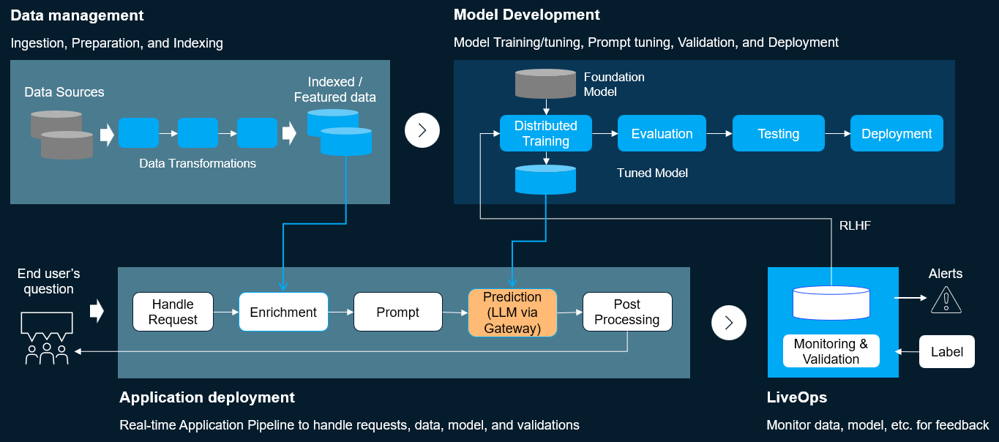

(genai-dev-flow)=

# GenAI development workflow

MLRun automates the flow of tuning, validation, optimizing the LLMs to specific data - efficiently over elastic resources. 
It rapidly deploys scalable real-time serving and application pipelines that host the LLM as well as the data integration and business logic.
MLRun has built-in monitoring for LLM data, training, model, and resources, with automated model retraining.
It is an open solution, supporting various LLMs and flexible deployment options (any cloud, on-prem).

The general stages of developing and scaling a GenAI model across an enterprise entails:
1. Personalize a pre-trained model with your pre-trained data.
2. Implement measures to reduce risk: data quality (preparing data before the training), testing (ensure the model is 
doing exactly what it should be doing), guard rails (answers are correct, not toxic, etc.), human feedback (examine it and return the model).
2. Build a scalable, automated, and continuous development environment.

GenAI is a workflow in constant motion.

It's important to keep your design flexible. New solutions come out all the time, and you 
may find a better one in the near future.

A GenAI scenario may utilize multiple models over an entire flow. The simpler models (evaluating input for toxicity, or ??) 
probably do not need an LLM, whereas the main model does require an LLM. understand your various models so that you can 
apportion your resources appropriately. (See {ref}`mlops-dev-flow` for more details about non-LLM models.)

GenAI flows are based on pre-made models. How to choose a model? Sizing? Resources? Spot instances GPU?

How to work with vector DB. Flexibility of inpit data, scalability, speed/performance

The implementation of a GenAI workflow is illustrated in the following figure:




GenAI tracks:
- text
- images
- audio
- video

Important to evaluate
- Resources
- Many models in the function hub. How to choose your model? Sizing? Use case?

Spot instances GPI

How to work with vector DB

training/fine tuninghugging face


## MLOps tasks

`````{div} 

````{grid} 4 
:gutter: 2

```{grid-item-card} Project management and CI/CD automation
:columns: 12
:text-align: center
:link: ./projects/project.html
```

```{grid-item-card} Ingest and process data
:text-align: center
:link: ./data-prep/index.html
```

```{grid-item-card} Tune (train) models 
:text-align: center
:link: ./development/index.html
```

```{grid-item-card} Deploy models and apps
:text-align: center
:link: ./deployment/index.html
```

```{grid-item-card} Monitoring
:text-align: center
:link: ./monitoring/index.html
```

````

`````

The [**GenAI development workflow**](./mlops-dev-flow.html) section describes the different tasks and stages in detail.
MLRun can be used to automate and orchestrate all the different tasks or just specific tasks (and integrate them with what you have already deployed).

### Ingest and process data

MLRun provides abstract interfaces to various offline and online [**data sources**](./store/datastore.html), supports batch or realtime 
data processing at scale, data lineage and versioning, structured and unstructured data, and more. Removing inapropriate data at an 
early stage saves resources that would otherwise be required later on **which phase?**

`````{div} full-width
{octicon}`mortar-board` **Docs:**
{bdg-link-info}`Ingest and process data <ingesting-process-data>`
{bdg-link-info}`Data and artifacts <./concepts/data.html>`
<br> {octicon}`code-square` **Tutorials:**
{bdg-link-primary}`NAME <./tutorials/FILENAME>`

`````

### Tuning (training) models

Take an existing model operationalize it through all of its life cycle phases: 
data collection, data preparation, training and evaluation, producing a fully automated pipeline.
Take base model, add layers for your data, results in tuned model
Evaluate model to make sure it's doing the right thing
extensive testing
Deploy using automated deployment

{bdg-link-primary-line}`more... <./development/index.html>`

`````{div} full-width
{octicon}`mortar-board` **Docs:**
{bdg-link-info}`Develop and train models <development>`
{bdg-link-info}`Model training and tracking <./development/model-training-tracking.html>`
{bdg-link-info}`Batch runs and workflows <./concepts/runs-workflows.html>`
<br> {octicon}`code-square` **Tutorials:**
{bdg-link-primary}`Train, compare, and register models <./tutorials/02-model-training.html>`
{bdg-link-primary}`Automated ML pipeline <./tutorials/04-pipeline.html>`
<br> {octicon}`video` **Videos:**
{bdg-link-warning}`Train and compare models <https://youtu.be/bZgBsmLMdQo>`
`````

### Application serving pipeline

productize the newly trained LLM as a serverless function
receives data from API/bot
contextualizes it with a state, possible vectors, doc to examine etc
prompt engineering - tuning the question to the model so it behaves exactly as you want
Feed it into the foundation model which gives result. The result is not necessarily the final result. Need to clean, format, check for toxic material, intellectual property

MLRun rapidly deploys and manages production-grade real-time or batch application pipelines using elastic and resilient serverless functions. MLRun addresses the entire ML application: intercepting application/user requests, running data processing tasks, inferencing using one or more models, driving actions, and integrating with the application logic.
{bdg-link-primary-line}`more... <./deployment/index.html>`

`````{div} full-width
{octicon}`mortar-board` **Docs:**
{bdg-link-info}`Deploy models and applications <deployment>`
{bdg-link-info}`Realtime pipelines <./serving/serving-graph.html>`
{bdg-link-info}`Batch inference <./deployment/batch_inference.html>`
<br> {octicon}`code-square` **Tutorials:**
{bdg-link-primary}`Realtime serving <./tutorials/03-model-serving.html>`
{bdg-link-primary}`Batch inference <./tutorials/07-batch-infer.html>`
{bdg-link-primary}`Advanced pipeline <./tutorials/07-batch-infer.html>`
<br> {octicon}`video` **Videos:**
{bdg-link-warning}`Serve pre-trained models <https://youtu.be/OUjOus4dZfw>`
`````

### Monitor and alert

Monitor results in a monitoring system, examine behavior, label results, put a feedback group

old:
Observability is built into the different MLRun objects (data, functions, jobs, models, pipelines, etc.), eliminating the need for complex integrations and code instrumentation. With MLRun, you can observe the application/model resource usage and model behavior (drift, performance, etc.), define custom app metrics, and trigger alerts or retraining jobs.
{bdg-link-primary-line}`more... <./monitoring/index.html>`

`````{div} full-width
{octicon}`mortar-board` **Docs:**
{bdg-link-info}`Monitor and alert <monitoring>`
{bdg-link-info}`Model monitoring overview <./monitoring/model-monitoring-deployment.html>`
<br> {octicon}`code-square` **Tutorials:**
{bdg-link-primary}`Model monitoring and drift detection <./tutorials/05-model-monitoring.html>`
`````

<a id="core-components"></a>
## MLRun core components

MLRun includes the following major components:

````{grid} 6
:gutter: 2

```{grid-item-card} Project management & automation (SDK, API, etc.)
:columns: 12
:text-align: center
:link: ./projects/project.html
```

```{grid-item-card} Serverless functions
:columns: 6 4 4 2
:text-align: center
:link: ./runtimes/functions.html
```

```{grid-item-card} Data & artifacts
:columns: 6 4 4 2
:text-align: center
:link: ./concepts/data.html
```

```{grid-item-card} Feature store
:columns: 6 4 4 2
:text-align: center
:link: ./feature-store/feature-store.html
```

```{grid-item-card} Batch runs & workflows 
:columns: 6 4 4 2
:text-align: center
:link: ./concepts/runs-workflows.html
```

```{grid-item-card} Real-time pipelines
:columns: 6 4 4 2
:text-align: center
:link: ./serving/serving-graph.html
```

```{grid-item-card} Monitoring
:columns: 6 4 4 2
:text-align: center
:link: ./monitoring/index.html
```

````